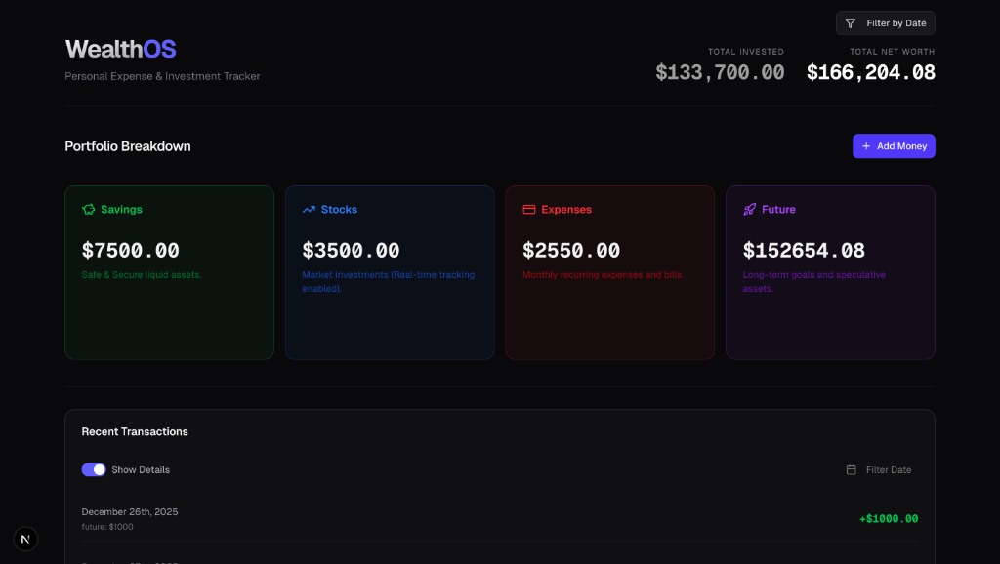
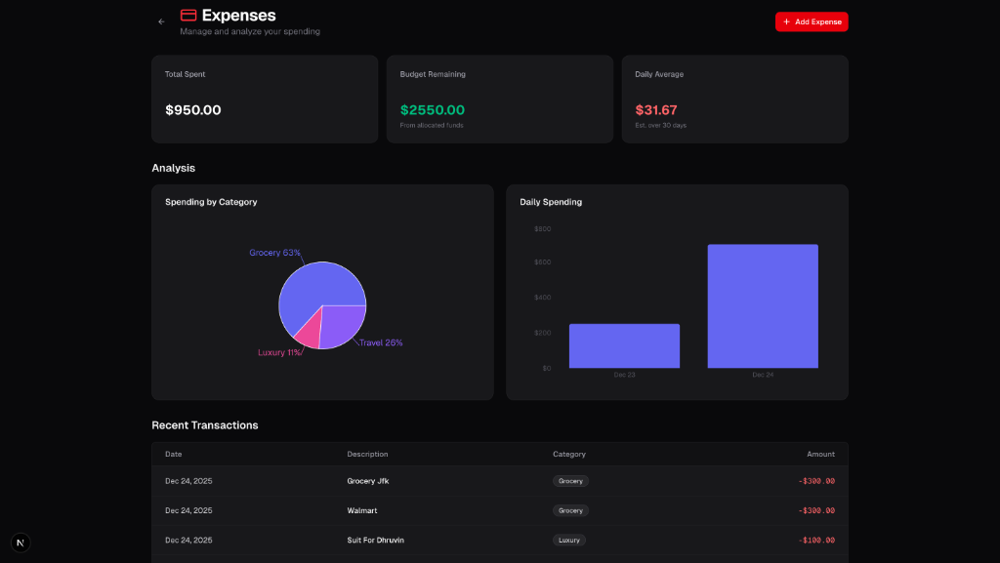
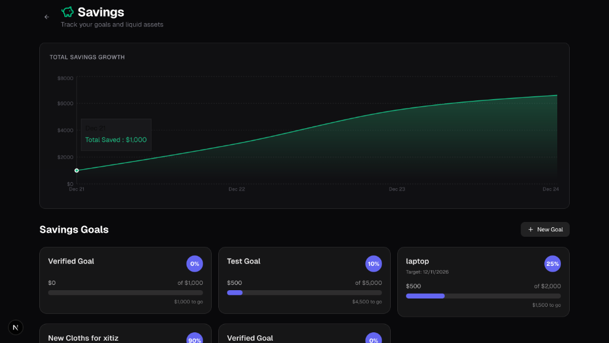
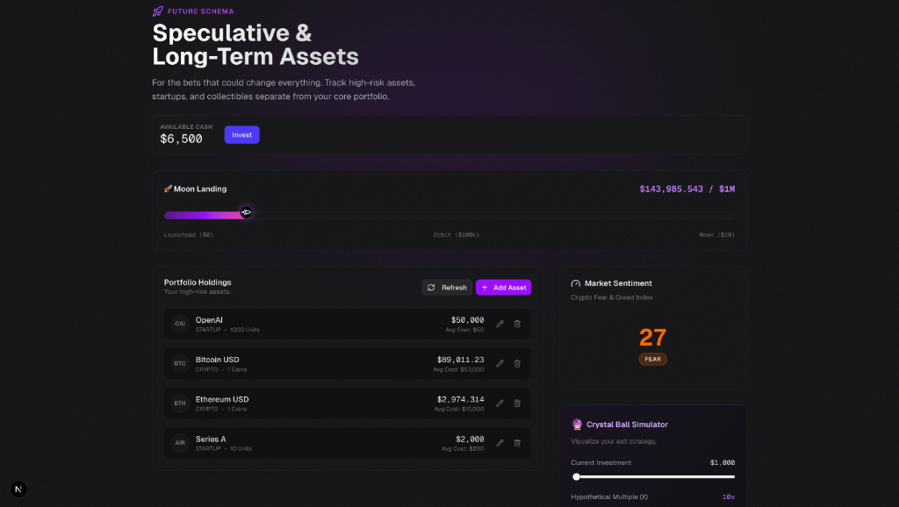

# Wealth Management Dashboard

A comprehensive personal finance application designed to help you track expenses, manage savings goals, monitor stock investments, and plan for the future. Built with modern web technologies for a seamless and responsive user experience.

## 🚀 Features

### 1. **Financial Dashboard**
- **Central Hub**: View your total allocated funds, current balance, and recent activity at a glance.
- **Smart Allocations**: Automatically distribute incoming funds across different schemas (Savings, Stocks, Future) based on your preferences.
- **Transaction History**: Detailed log of all financial movements with filtering and sorting capabilities.

### 2. **Expense Tracking**
- **Categorized Expenses**: Log daily expenses with specific categories (e.g., Food, Transport, Utilities).
- **Budget Monitoring**: Visual charts and graphs to track spending against your income.
- **Monthly Insights**: Analyze spending trends over time.

### 3. **Savings Goals**
- **Goal Management**: Create and track multiple savings goals (e.g., "Emergency Fund", "New Car").
- **Visual Progress**: Dynamic progress bars and color-coded cards to keep you motivated.
- **Allocations**: Directly allocate funds to specific goals from your main dashboard.

### 4. **Stock Portfolio**
- **Real-time Tracking**: Monitor your stock and ETF holdings with accurate price updates.
- **Performance Metrics**: View total invested amount, current value, and return on investment (ROI).
- **Transaction History**: Keep a record of all buy/sell orders and dividend payments.

### 5. **Future Planning**
- **Long-term Vision**: Tools to visualize long-term asset growth and vesting schedules.
- **Risk Analysis**: Heatmaps and sentiment gauges to assess portfolio risk.
- **Asset Projection**: "Crystal Ball" features to project future net worth based on current trajectories.

## 📸 Screenshots

<div align="center">
  
  <p><em>Financial Dashboard</em></p>
  
  
  <p><em>Expense Tracking</em></p>

  
  <p><em>Savings Goals</em></p>
  
  
  <p><em>Stock Portfolio</em></p>

  
  <p><em>Future Planning</em></p>
</div>

## 🛠️ Tech Stack

- **Framework**: [Next.js 15](https://nextjs.org/) (App Router)
- **Language**: [TypeScript](https://www.typescriptlang.org/)
- **Styling**: [Tailwind CSS](https://tailwindcss.com/)
- **UI Components**: [Radix UI](https://www.radix-ui.com/) & [Lucide Icons](https://lucide.dev/)
- **Charts**: [Recharts](https://recharts.org/)
- **State Management**: [Zustand](https://github.com/pmndrs/zustand)
- **Database**: [SQLite](https://www.sqlite.org/) with [Prisma ORM](https://www.prisma.io/)
- **Date Handling**: [date-fns](https://date-fns.org/)

## 📦 Installation & Setup

Follow these steps to get the project running on your local machine.

### Prerequisites
- Node.js (v18 or higher)
- npm or yarn

### 1. Clone the Repository
```bash
git clone https://github.com/Arthgitt/wealth-management.git
cd wealth-management
```

### 2. Install Dependencies
```bash
npm install
# or
yarn install
```

### 3. Database Setup
Initialize the SQLite database and run migrations.

```bash
# Push the Prisma schema to the database
npx prisma db push

# (Optional) Seed the database if a seed script is provided
# npx prisma db seed
```

### 4. Run the Development Server
```bash
npm run dev
# or
yarn dev
```

Open [http://localhost:3000](http://localhost:3000) with your browser to see the application.

## 📖 Usage Guide

### Allocating Funds
1. Navigate to the **Home** dashboard.
2. Click on the **"Add Money"** button.
3. Enter the amount you wish to deposit.
4. The system will automatically suggest allocations based on your schemas. You can adjust these manually.
5. Confirm to update your balances.

### Adding Expenses
1. Go to the **Expenses** tab.
2. Click **"Add Expense"**.
3. Enter the amount, description, and select a category.
4. The expense will be deducted from your available budget.

### Managing Savings
1. Go to the **Savings** tab.
2. Create a new goal by entering a name, target amount, and deadline.
3. View your progress and add specific contributions to each goal.

### Tracking Stocks
1. Go to the **Stocks** tab.
2. Use the **"Trade"** button to record buy/sell transactions.
3. Enter the ticker symbol, quantity, and price.
4. The dashboard will update with your current portfolio value.

## 🤝 Contributing

Contributions are welcome! Please feel free to submit a Pull Request.

1. Fork the repository
2. Create your feature branch (`git checkout -b feature/AmazingFeature`)
3. Commit your changes (`git commit -m 'Add some AmazingFeature'`)
4. Push to the branch (`git push origin feature/AmazingFeature`)
5. Open a Pull Request

